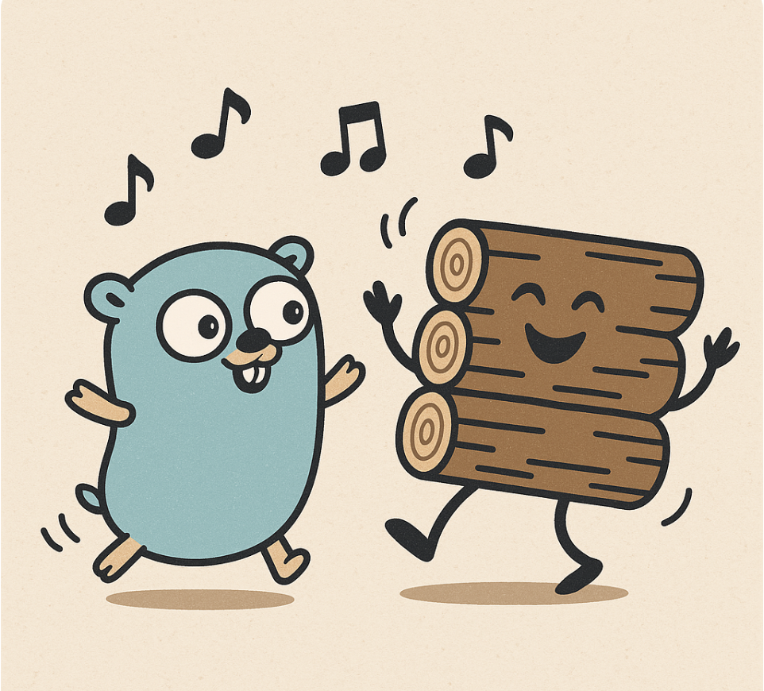
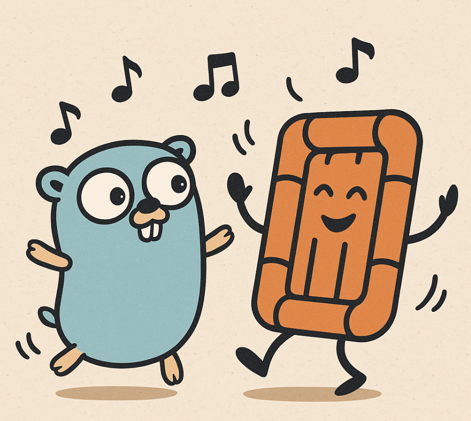

## Paper and Learning Web

https://raft.github.io/

## In-Progress
AppendEntries of Paper

## Backlog

### Raft Paper
- [ ] AppendEntries (WIP)
- [ ] Log Replication
- [ ] Persistence
- [ ] Membership Changes
- [ ] Log Compaction
- [ ] Example of Pluggable State Machine

### Infra Framework
- [ ] rate limiter
- [ ] pressure testing
- [ ] otel: metrics
grpc part
https://grpc.io/docs/guides/performance/
- [ ] try to change to streaming RPCs (with keep alive) or keep both and do a benchmarking
- [ ] channel optimization
- [ ] error handling
- [ ] authentication
- [ ] flow control
      
| Number | Feature Topic                                                        |
| ------ | -------------------------------------------------------------------- |
| 1      | deadline/timeout                                                     |
| 2      | graceful shutdown (https://grpc.io/docs/guides/server-graceful-stop) |
| 3      | server/client interceptors                                           |
| 4      | compression                                                          |
| 5      | retry (partially used)                                               |

## Patterns for GoGymnastics
- [ ] async all with future pattern
- [ ] retry call with timeout
- [ ] fan-in/fan-out in RAFT
- [ ] short stopping in RAFT
- [ ] ticker, timer
- [ ] context examples summary
- [ ] plummer and channels

## Implementation Decisions and Extreme Engineering
- [ ] add batching to handling ClientCommands, and send AppendLogEntries
- [ ] check prof Yang's improvements of paxos for ideas
- [ ] check architecture classes of caching and memory hierarchy for ideas

## History Logs

### v0.1.0 leader eleaction, server framework -- April/May 2025

## Infra Framework
- [x] configuration: unified conf file, env
- [x] docker: docker file and docker compose

#### Module2: Consensus
- [x] framework: sending framework, based on term
- [x] framework: receiving framework, based on term
- [x] framework: sending framework, based on log and commit index
- [x] framework: receiving framework, based on log and commmit index

#### Module3: Membership
- [x] Fixed Membership thru config

#### Module1: Leade Election
- [x] leader election
- [x] testing: basic features
- [x] testing: simulate adversial cases in async network env (clock drifting, delay, partition)

#### Module0: Engineering Basics
- [x] rpc-client framework
- [X] rpc-server framework
- [x] logging
- [x] configuration management

#### Bug List 
- [x]when 2 nodes run together, no one becomes the leader
- [x]when 3 nodes run together, the first leader will panic because appendEntries return the incorrect term
- [x]when running server-1, the rpc send doesn't get connection refused error -> not logged?
- [x]cancel func deffered before assigned, probably the reason to panic;
- [x]server get the request, no one handles it;

#### gRPC refinement
- [x] reading the following grpc docs to solidify current implementation
    - https://grpc.io/docs/guides/health-checking/ 
    - https://grpc.io/docs/guides/server-graceful-stop/
    - https://grpc.io/docs/guides/cancellation/
    - https://grpc.io/docs/guides/error/
    - https://grpc.io/docs/guides/deadlines/ (DONE)

### Week April 13-19 2025
- [x] fix all todos and summarize into go-gymnastics (30%)
- [x] make the first version of leaderselection runnable and playable (30%)

### Week April 7-12 2025 (All Done)
- [x] current rpc layers are unncessarily complicated, design what are really needed for appendEntries/heartbeat in consensus, the two are different (record designs)
- [x] add network of RPC (server and client)
- [x] design the simplest membership that can work, put it in gogynastics
